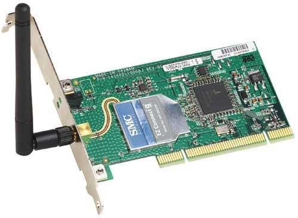
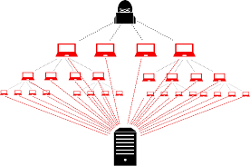

<!--
 * @Author: kok-s0s
 * @Date: 2021-05-06 00:01:57
 * @LastEditTime: 2021-05-09 14:57:21
 * @Description: 基础知识
-->

## Web (World Wide Web)

分前端和后端
两者靠协议(http,https 等)进行交互

**前端**

- HTML 基本的构造，裸漏的“身体”
- CSS 化妆，衣服等，覆盖在“身体”之上
- JavaScript 让“身体”动起来，完成某些动作！

**后端**

即一个部署在服务器的程序。

后端相当于该“身体”的“主宰”，身体想要什么，会去问这个主宰，主宰会给出应答。

**数据库**

即一个存放数据的容器

相当个储物柜

**协议**

规定好的通讯，交流方式。

**Web 安全**

前端，后端，数据库，协议，哪方面出现些问题了。

**服务器**

性能很强的电脑

**IP 地址，端口**

IP 地址 (Internet Protocol Address) 是指互联网协议地址，全球唯一。

端口 (0~65535) 是每个软件的一个通讯进出口。

**局域网(内网) 广域网(外网)**

- LAN (Local Area Network)
  - `192.168.*.*`
  - `172.16.*.* ~ 172.31.*.*`
  - `10.*.*.*`
- WAN (Metropolitan Area Network)

**URL**

URL:Uniform Resource Locator 统一资源定位符

**MAC 地址**

MAC:Media Access Control 介质访问控制符 具有全球唯一性

**映射，端口映射**

将一个`IP1:id`(IP 地址:端口号)映射到另一个`IP2:id`上，当你访问 IP1 时，会间接访问到 IP2。

**域名 DNS**

IP 地址的别名。
`[kok-s0s.top]` -> `[202.182.102.233]`

host 文件

**网卡 网关**

硬件 联网设备

网关 网络的关口 有网卡就有网关

`tracert`命令
信息先从本地自身网关出发，最终到达目的地址。

**IPv4 IPv6**

用于分配 IP 地址

IPv4 容量比 IPv6 小

**IE 浏览器，其它浏览器**

普通软件

window 自带

用于搜索等

**Linux / Windows**

Operating System 操作系统

管理软件和硬件的一个“大”软件

Linux 多命令行

Windows 多图形化界面

**系统漏洞**

系统代码出现 BUG，漏洞

**虚拟机 / Docker**

虚拟机 能虚拟出另一个操作系统

Docker 容器

**桥接 / NAT**

桥接-虚拟机和主机是平级关系

NAT-虚拟机和主机是父子关系

**Shell / WebShell**

Shell 一个控制操作计算机的命令行界面

WebShell 通过网页形式控制操作计算的命令行网页界面

**正向 / 反向 Shell**

正向 黑客主动连接受害者

反向 受害者主动连接黑客

**暴力破解/字典/弱口令**

弱口令：比较弱的密码

字典：一系列密码

暴力破解：循环尝试

**Cookie / Session**

都是文件

Cookie 数据存放在客户端

Session 数据存放在服务端

即一个保存状态的文件或者数据

**ByPass**

绕过

**漏洞 / 0Day 漏洞**

漏洞即程序员些程序或者设计软硬件时设计不当而产生的 BUG，漏洞。

0Day 即最新产生的漏洞

**攻击、入侵、渗透、DDOS、肉鸡**

获取目标的信息，或者获取目标的 shell，或者直接把目标打死

DDOS 拒绝服务攻击

肉鸡 即黑客已经攻击占领的计算机

**代码审计**

看代码找 BUG，漏洞。

审计工具帮助安全人员快捷找 BUG，漏洞。

**CTF AWD**

CTF 夺旗赛

AWD (Attack With Defence)

**靶机 DVWA CMS**

靶机即搭建好漏洞测试环境的计算机

CMS 是内容管理系统，即后台。

**渗透 攻击工具**

kali

Sqlmap

Burpsuite

**后渗透**

攻击完成，建立持久访问。
