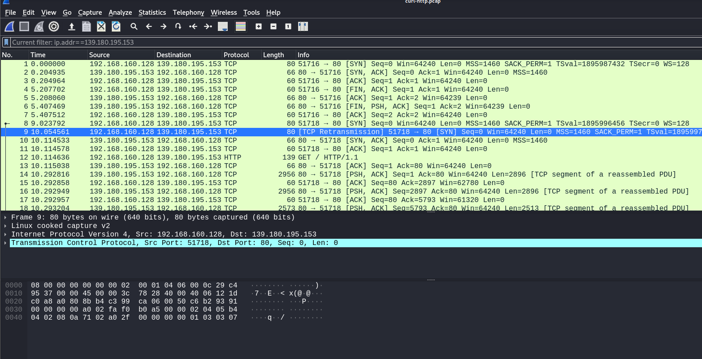
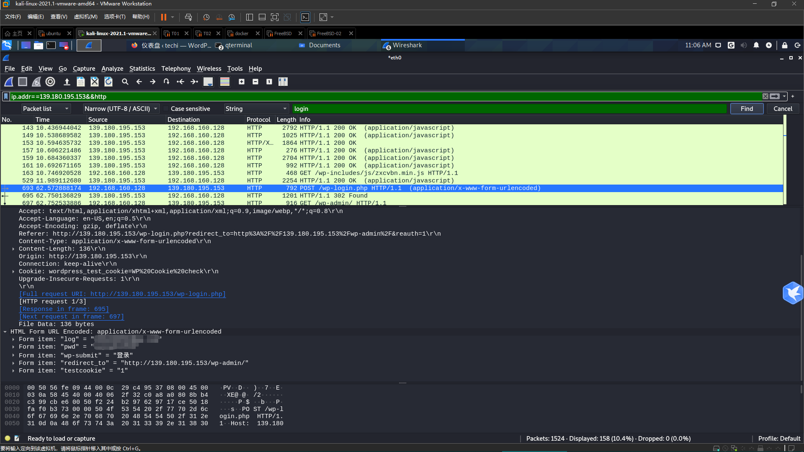
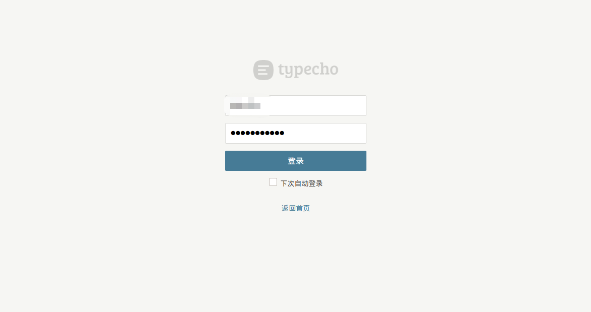
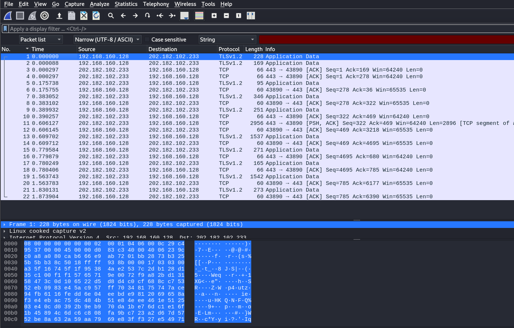
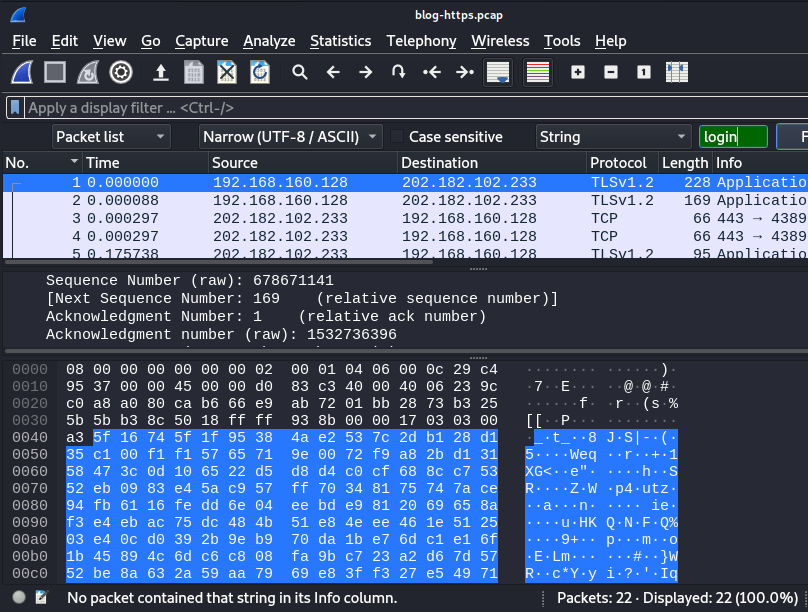
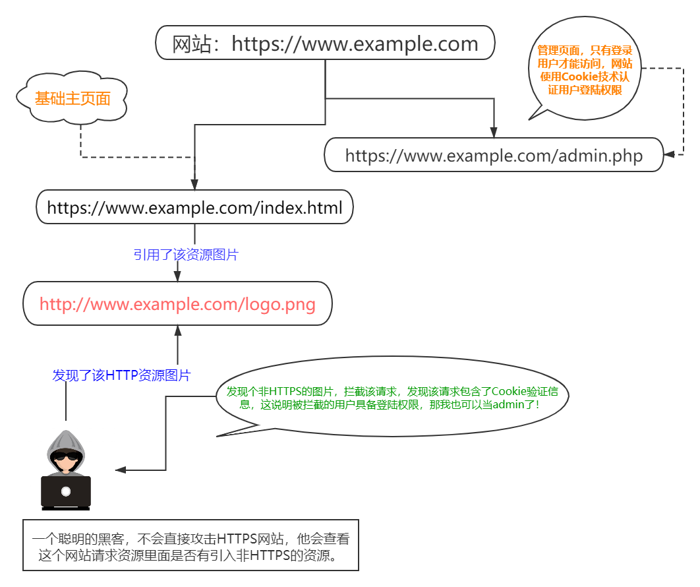
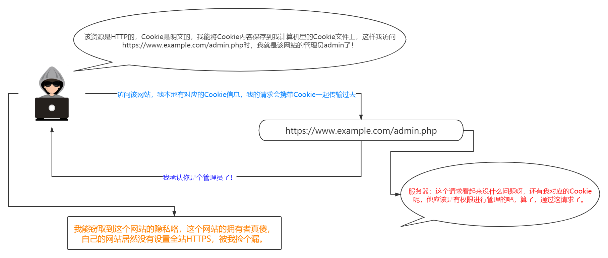

# 建站过程

## HTTP 网站的搭建

**Key Words**
docker vps wordPress

**准备工作**
一个云服务器，推荐在 vultr 上购买个，建议选择 Ubuntu 系统，简单易上手！

利用你选择的工具(xshell，VSCode，and so on)远程连接你的云服务器；

连接 update 过后，下载 `docker.io` 和 `docker-compose`；

**配置**
编写一个脚本 yml 格式，便于安装所有必须软件，我这里提供一个简易的脚本：

```yml
version: "2.0"

services:
  db:
    image: mysql:5.7
    volumes:
      - /root/db/:/var/lib/mysql
    restart: always
    environment:
      MYSQL_ROOT_PASSWORD: **********（自定义）
      MYSQL_DATABASE: wordpress
      MYSQL_USER: wordpress
      MYSQL_PASSWORD: **********（自定义）

  wordpress:
    depends_on:
      - db
    image: wordpress
    ports:
      - "80:80"
    restart: always
    environment:
      WORDPRESS_DB_HOST: db:3306
      WORDPRESS_DB_USER: wordpress
      WORDPRESS_DB_PASSWORD: **********（自定义）
    volumes:
      - /root/www/:/var/www/html
```

运行脚本命令：docker-compose -f docker-compose.yml up -d

此时，在浏览器访问你的网站 IP 地址，你会看到 WordPress 的安装引导，根据提示进行就行了。

之后便可自定义出你自己专属的网站了！

想要备份，只要把你服务器里的 www，docker-compose.yml，db 三个东西拷贝下来就行了，想要再次使用，只需要在有和上述大致差不多配置的服务器也可以再次运行起来。

关闭很简单，执行命令：docker-compose -f docker-compose.yml down

## 测试 HTTP 网站

1. 使用`wireshark`抓包，浏览器与搭建的网站做交互，但却无法抓取到数据包；
2. 使用工具（WebPathBrute）扫描自己搭建的网站站点，此时，`wireshark`能够抓取到[数据包](./files/WireShark-Files/TestWordPress.pcapng);

对抓取的数据包做分析，的确包含网站的信息，实测出 HTTP 网站的不安全。HTTP 传输的数据包无加密，明文信息直接暴露，直接导致关键信息泄露，会造成很多方面的影响（隐私最为关键！）。

3. 使用 curl 命令测试

开启两个终端

```bash
tcpdump -i any  host 139.180.195.153 -w curl-http.pcap
```

```bash
curl http://139.180.195.153/
```

得到[相关数据包](./files/WireShark-Files/curl-http.pcap)，用 wireshark 进行查看。

得到下图



仔细查看里面的包数据是明文传输。

4. 测试获取自己该网站用户的账号密码

具体不展开，就是开着 wireshark 抓包，自己登录创建网站的后台管理网站，此时，wireshark 应该会抓到一个有`login`字符串的数据包。检索查看该包，如下图。



我能看到自己的账号密码，这直接说明使用 http 的网站是有多大风险。【doge】！！！

~~当你看到该文章，我已关闭我搭建的 http 网站，禁止 attack！~~

---

## 测试 HTTPS 网站

> 了解下行情，我就一个域名，舍不得钱，wordpress 搭建的动态网站也是第一次接触，上网查看基本是需要有个域名才能申请证书，无法在只有个 ip 地址的情况下申请到。所以测试 HTTPS 网站这块的对象是我搭建的博客。

**登录博客后台**



tcpdump 监听抓取[数据包](./files/WireShark-Files/blog-https.pcap)


查看数据包






抓取到的数据包都被加密了，无法查看明文信息，更不用说能检索到`login`字符串了。网站的安全性相较 http 的网站是大大提高的。

---

## 全站 HTTPS 策略

该策略主要针对开发者。

对于一个网站来说，部署 HTTPS 网站并不代表绝对的安全，HTTPS 只是保证某个连接上请求数据的安全性，但 Web 页面由许多元素构成，如果只有主页面支持 HTTPS 是不够的，所有引用的元素也必须支持 HTTPS，否则就会引发 Web 安全风险。

eg：如下图的情况





为保证一个网站的绝对安全，应实施全站 HTTPS 策略：

- 网站涉及的域名必须都配置证书，并启用 HTTPS。
- 网站引用的所有元素，必须支持 HTTPS。
- 暴露在互联网上的 HTTP URL 地址，必须重定向到 HTTPS 请求上。

全站 HTTPS 策略相关技术：

- 使用 301，302 重定向技术。
- 使用 HSTS 技术，相较 301 重定向，更保证安全性。
- 使用其它的 HTTP 头部，比如`Content-Security-Policy`。

**Question**

如果一个网站的登录系统没改，只是改了 https，情况会如何？

**Answer**

这说明登陆系统相关域名和关联的元素都是 HTTP 的，域名没有启用 HTTPS 和元素不支持 HTTPS，那么攻击者完全可以进行监听该网站，查看别人发送过来的请求信息是否有非 HTTPS 的，如果有一个该登录系统的管理者要登录该系统，发送有`login`信息的请求包，攻击者监听该数据包，因为该请求包的信息是明文，能直接获取到账户密码的信息。攻击者就也可以作为一个管理员的身份登录到该网站的管理后台了。攻击者也能进行更多隐私管理操作。
